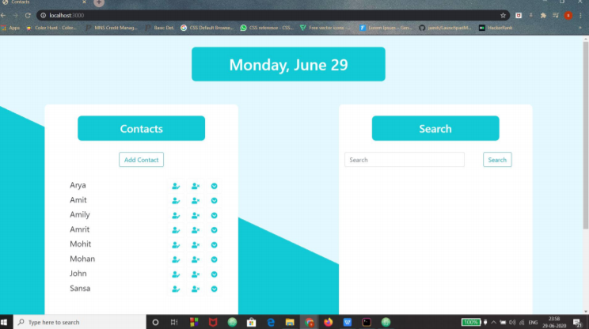
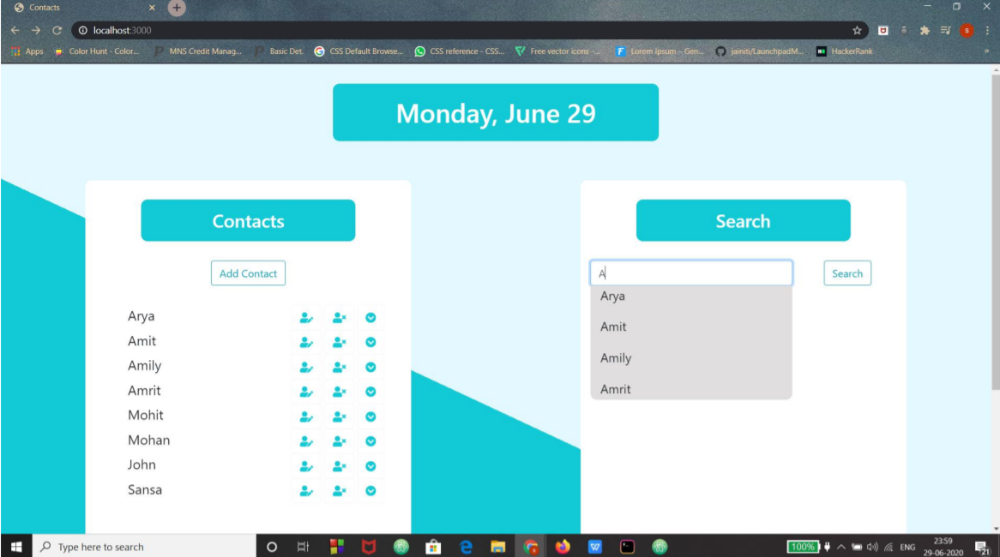

# Contact List Manager With Auto Suggestion

The main objective of developing this project Contact list manager is to storing the detail of the employees
and other persons in an efficient manner. It can help for storing details like Name, Contact number, Email
address. It stores the data in a mongoDB database which is a document-oriented NoSQL database used to
store large amount of data. It can manage the data with features such as adding new contact, deleting the existing contact or updating the
existing contact.
The main focus of the project is to make efficient searching by implementing the feature of autosuggestion.

## OUTPUT

--

